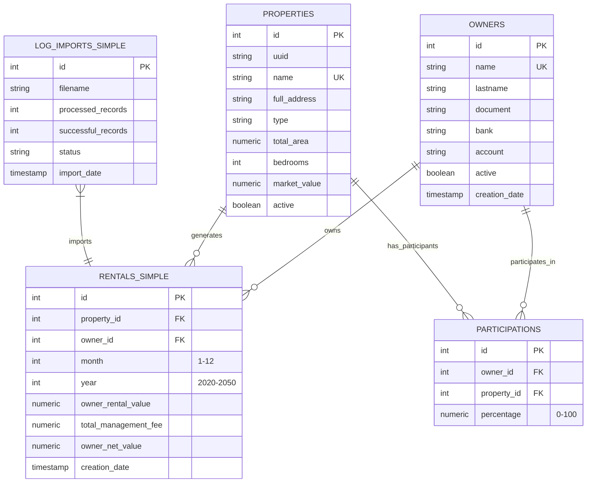

# 🏠 Rental Management System V2

**A complete and professional system for managing rentals, owners, properties, and participations. Modern, scalable, and automated architecture.**

[](./VERSION)
[](https://fastapi.tiangolo.com/)
[](https://www.postgresql.org/)
[](https://www.docker.com/)
[](./LICENSE)

---

## 📋 Executive Summary

RentalManagementSystemV2 is a complete solution for real estate management, automating rental processes, data import, financial reports, and the administration of owners and properties. It includes a robust backend, a modern frontend, automation scripts, and technical documentation.

---

## 🏗️ Project Structure

```text
RentalManagementSystemV2/
├── backend/           # Modular FastAPI API
├── frontend/          # Modern and modular frontend
├── database/          # Scripts, backups, and migrations
├── scripts/           # Automation and maintenance
├── docs/              # Technical documentation
├── logs/              # System logs
├── storage/           # Files and uploads
├── docker-compose.yml # Container orchestration
├── run_script.sh      # Master management script
└── README.md          # Main documentation
```
---

## 🛠️ Technology Stack

### Backend
- **FastAPI** (Python 3.10+)
- **SQLAlchemy** (ORM)
- **PostgreSQL 15+**
- **Pandas** (for Excel processing)
- **Uvicorn** (ASGI server)
- **JWT** (for authentication)

### Frontend
- **HTML5/CSS3/JavaScript ES6+**
- **Bootstrap 5**
- **Chart.js**
- **Fetch API**

### DevOps
- **Docker & Docker Compose**
- **Nginx** (optional)
- **Adminer** (DB management)
- **Bash Scripts**

---

## 🚀 Quick Start (Docker)

1.  **Clone and access the project**
    ```bash
    git clone https://github.com/[YOUR_USERNAME]/RentalManagementSystemV2.git
    cd RentalManagementSystemV2
    ```
2.  **Start the entire system**
    ```bash
    chmod +x run_script.sh
    ./run_script.sh start
    ```
3.  **Access the system**
    - 🌐 **Frontend**: http://localhost:3000
    - 🔧 **Backend API**: http://localhost:8000
    - 📚 **API Documentation**: http://localhost:8000/docs
    - 🗄️ **Adminer (DB)**: http://localhost:8080

---

## 🧩 Modules and Features

### Backend (FastAPI)
- Complete CRUD for owners, properties, rentals, and participations
- Data import via Excel (validation, logs, audit)
- Documented RESTful endpoints
- Advanced reports and statistics
- Data security and validation
- JWT authentication

### Frontend
- Modern and responsive interface
- Dashboard with interactive charts
- Modular navigation system
- Data import with drag & drop and Excel templates
- Data pre-validation and analysis
- Mandatory login modal

### Database
- Normalized and optimized structure
- Relationships between owners, properties, rentals, and participations
- Import audit
- Migration and cleaning scripts

### Automation and Scripts
- Scripts for migration, backup, cleaning, and verification
- Full orchestration with Docker Compose
- Centralized monitoring and logs

---

## 🔗 Main Endpoints

### Rentals
| Method | Endpoint | Description |
|---|---|---|
| GET | /alugueis/ | List rentals |
| POST | /alugueis/ | Create rental |
| PUT | /alugueis/{id} | Update rental |
| DELETE | /alugueis/{id} | Delete rental |

### Owners
| Method | Endpoint | Description |
|---|---|---|
| GET | /api/v1/propietarios/ | List owners |
| POST | /api/v1/propietarios/ | Create owner |

### Properties
| Method | Endpoint | Description |
|---|---|---|
| GET | /api/v1/inmuebles/ | List properties |
| POST | /api/v1/inmuebles/ | Create property |

### Excel Import
| Method | Endpoint | Description |
|---|---|---|
| POST | /api/v1/importacao/excel/ | Import data from Excel |

---

## 🗄️ Database Schema

### Main Tables
-   **owners**: Personal and bank data
-   **properties**: Detailed information of properties
-   **rentals_simple**: Monthly record per owner and property
-   **participations**: Co-ownership percentages
-   **log_imports_simple**: Audit of imports

### Relationships
-   An owner can have many rentals and participations
-   A property can have many rentals and participations
-   A rental is unique per property, owner, month, and year

### Constraints
-   Uniqueness and checks on key fields
-   Referential and logical integrity



---

## ⚡ Troubleshooting and Maintenance

### Common Problems
-   **Port already in use**: `./run_script.sh stop && ./run_script.sh start`
-   **Database not accessible**: `docker-compose restart postgres`
-   **Import failed**: Check the format and logs in `logs/import_*.log`

### Maintenance Scripts
-   `aplicar_estrutura_final.sh`: DB migration
-   `limpar_base_datos.sh`: Complete cleaning
-   `backup_database.sh`: Manual backup
-   `reset_emergencia.sh`: Total reset

### Monitoring
-   Centralized logs in `logs/`
-   Command: `./run_script.sh logs -f`

---

## 🤝 Contribution

1.  Fork the repository
2.  Create a branch (`git checkout -b feature/new-feature`)
3.  Make descriptive commits
4.  Push and open a Pull Request
5.  Follow the code and documentation standards

---

## 📄 License and Credits

MIT. See [LICENSE](LICENSE).

**Developed by:** Your Name ([Your GitHub](https://github.com/your-username)) and contributors

**Acknowledgments:** FastAPI, PostgreSQL, Bootstrap, Chart.js, and the open-source community

---

⭐ **Give it a star if you found it useful!** ⭐
