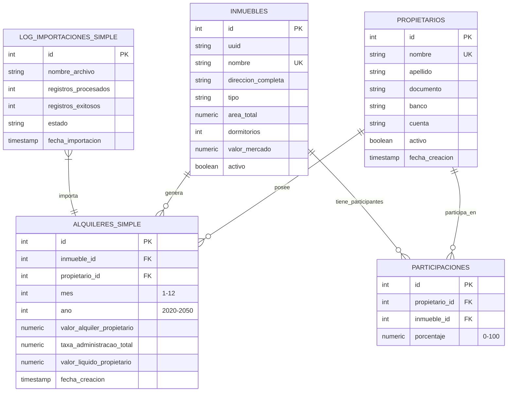

# 🏠 Sistema de Aluguéis V1

**Sistema completo e profissional para gestão de aluguéis, proprietários, imóveis e participações. Arquitetura moderna, escalável e automatizada.**

### 🆕 Atualização Agosto 2025
- Corrigido: Dashboard móvel agora mostra corretamente o valor total de aluguel do último mês.
- Corrigido: Tela de imóveis móvel mostra corretamente o status "Alugado" conforme o campo `ativo` do banco de dados.
- Corrigido: Tela de aluguéis móvel mostra os valores reais usando o campo `valor_liquido_proprietario`.
- Todos os cálculos e exibições de valores foram revisados para garantir consistência com os dados do backend.

[](./VERSION)
[](https://fastapi.tiangolo.com/)
[](https://www.postgresql.org/)
[](https://www.docker.com/)
[](./LICENSE)

---

## 📋 Resumo Executivo

SistemaAlugueisV2 é uma solução completa para gestão imobiliária, automatizando processos de aluguel, importação de dados, relatórios financeiros e administração de proprietários e imóveis. Inclui backend robusto, frontend moderno, scripts de automação e documentação técnica.

---

## 🏗️ Estrutura do Projeto

```text
SistemaAlquileresV2/
├── backend/           # API FastAPI modular
├── frontend/          # Frontend moderno e modular
├── database/          # Scripts, backups e migrações
├── scripts/           # Automação e manutenção
├── docs/              # Documentação técnica
├── logs/              # Logs do sistema
├── storage/           # Arquivos e uploads
├── docker-compose.yml # Orquestração de containers
├── run_script.sh      # Script mestre de gestão
└── README.md          # Documentação principal
```

---

## 🛠️ Tecnologias Utilizadas

### Backend
- **FastAPI** (Python 3.10+)
- **SQLAlchemy** (ORM)
- **PostgreSQL 15+**
- **Pandas** (processamento de Excel)
- **Uvicorn** (ASGI server)
- **JWT** (autenticação)

### Frontend
- **HTML5/CSS3/JavaScript ES6+**
- **Bootstrap 5**
- **Chart.js**
- **Fetch API**

### DevOps
- **Docker & Docker Compose**
- **Nginx** (opcional)
- **Adminer** (gestão BD)
- **Bash Scripts**

---

## 🚀 Instalação Rápida (Docker)

1. **Clone e acesse o projeto**
   ```bash
   git clone https://github.com/[SEU_USUARIO]/SistemaAlugueisV2.git
   cd SistemaAlugueisV2
   ```
2. **Inicie todo o sistema**
   ```bash
   chmod +x run_script.sh
   ./run_script.sh start
   ```
3. **Acesse o sistema**
   - 🌐 **Frontend**: http://localhost:3000
   - 🔧 **API Backend**: http://localhost:8000
   - 📚 **Documentação API**: http://localhost:8000/docs
   - 🗄️ **Adminer (BD)**: http://localhost:8080

---

## 🔒 Novas Funcionalidades de Autenticação

### Login Seguro
- Modal de login obrigatório para todos os usuários
- Autenticação via usuário e senha (exemplo: admin/admin)
- Token JWT gerado e validado no backend
- Dados de autenticação mantidos apenas na sessão (não são salvos no navegador)
- A cada recarregamento de página, o sistema exige novo login
- Logout limpa todos os dados e força novo login

### Fluxo de Usuário
1. **Acesso ao sistema:** Modal de login aparece automaticamente
2. **Login realizado:** Usuário acessa todas as funcionalidades normalmente
3. **Recarregamento (Ctrl+F5):** Modal de login aparece novamente, exigindo nova autenticação
4. **Logout:** Limpa dados e exige novo login

### Segurança
- Nenhum dado de autenticação é persistido entre sessões
- Validação de token sempre feita no backend
- Usuário só acessa o sistema após autenticação válida

---

## 🧩 Módulos e Funcionalidades

### Backend (FastAPI)
- CRUD completo de proprietários, imóveis, aluguéis e participações
- Importação de dados via Excel (validação, logs, auditoria)
- Endpoints RESTful documentados
- Relatórios e estatísticas avançadas
- Segurança e validação de dados
- Autenticação JWT

### Frontend
- Interface moderna e responsiva
- Dashboard com gráficos interativos
- Sistema de navegação modular
- Importação de dados com drag&drop e templates Excel
- Validação e análise prévia dos dados
- Modal de login obrigatório

### Banco de Dados
- Estrutura normalizada e otimizada
- Relacionamento entre proprietários, imóveis, aluguéis e participações
- Auditoria de importações
- Scripts de migração e limpeza

### Automação e Scripts
- Scripts para migração, backup, limpeza e verificação
- Orquestração completa com Docker Compose
- Monitoramento e logs centralizados

---

## 🔗 Endpoints Principais

### Aluguéis
| Método | Endpoint | Descrição |
|--------|----------|-----------|
| GET    | /alugueis/           | Listar aluguéis |
| POST   | /alugueis/           | Criar aluguel   |
| PUT    | /alugueis/{id}       | Atualizar aluguel |
| DELETE | /alugueis/{id}       | Excluir aluguel |

### Proprietários
| Método | Endpoint | Descrição |
|--------|----------|-------------|
| GET    | /api/v1/propietarios/ | Listar proprietários |
| POST   | /api/v1/propietarios/ | Criar proprietário |

### Inmuebles
| Método | Endpoint | Descrição |
|--------|----------|-------------|
| GET    | /api/v1/inmuebles/ | Listar imóveis |
| POST   | /api/v1/inmuebles/ | Criar imóvel |

### Importação Excel
| Método | Endpoint | Descrição |
|--------|----------|-------------|
| POST   | /api/v1/importacao/excel/ | Importar dados desde Excel |

---

## 📥 Importação Masiva e Plantilhas Excel

O sistema suporta importação massiva de dados desde arquivos Excel. São fornecidas plantilhas para cada tipo de entidade:

- **Base2025.xlsx**: Proprietários, imóveis, participações, aluguéis
- **ModeloPropietarios.xlsx**: Estrutura de proprietários
- **ModeloInmuebles.xlsx**: Estrutura de imóveis
- **ModeloParticipacoes.xlsx**: Estrutura de participações
- **ModeloAlquileres.xlsx**: Estrutura de aluguéis

**Passos para importar:**
1. Baixar a plantilha pela interface
2. Preencher os dados seguindo o modelo
3. Subir o arquivo via drag&drop ou seleção
4. Analisar estrutura e validar dados
5. Confirmar importação

**Validações automáticas:**
- Formato e colunas requeridas
- Integridade referencial
- Unicidade de registros
- Auditoria e log de importações

---

## � Dashboard e Relatórios

- Gráficos de evolução mensal/anual
- Resumos por proprietário, imóvel e período
- Filtros avançados e exportação de dados
- Métricas financeiras em tempo real

---

## 🗄️ Esquema de Banco de Dados

Tabelas principais:
- **propietarios**: Dados pessoais e bancários
- **inmuebles**: Informação detalhada de propriedades
- **alquileres_simple**: Registro mensal por proprietário e imóvel
- **participaciones**: Porcentagens de co-propriedade
- **log_importaciones_simple**: Auditoria de importações

Relações:
- Um proprietário pode ter muitos aluguéis e participações
- Um imóvel pode ter muitos aluguéis e participações
- Um aluguel é único por imóvel, proprietário, mês e ano

Restrições:
- Unicidade e checks em campos chave
- Integridade referencial e lógica

---

## ⚡ Troubleshooting e Manutenção

### Problemas Comuns
- Porta ocupada: `./run_script.sh stop && ./run_script.sh start`
- Banco de dados não acessível: `docker-compose restart postgres`
- Importação falhou: Verificar formato e logs em `logs/import_*.log`

### Scripts de Manutenção
- `aplicar_estrutura_final.sh`: Migração de BD
- `limpar_base_datos.sh`: Limpeza completa
- `backup_database.sh`: Backup manual
- `reset_emergencia.sh`: Reseteo total

### Monitoramento
- Logs centralizados em `logs/`
- Comando: `./run_script.sh logs -f`

---

## 🚀 Roadmap e Melhorias Futuras

- Autenticação JWT e roles
- Dashboard avançado com WebSockets
- Exportação de relatórios PDF/Excel
- App móvel nativa
- Integração bancária e blockchain
- Tests automatizados e CI/CD

---

## 🤝 Contribuição

1. Faça um fork do repositório
2. Crie uma branch (`git checkout -b feature/nova-funcionalidade`)
3. Realize commits descritivos
4. Faça push e abra um Pull Request
5. Siga os padrões de código e documentação

---

## 📄 Licença e Créditos

MIT. Ver [LICENSE](LICENSE).

**Desenvolvido por:** Seu Nome ([Seu GitHub](https://github.com/seu-usuario)) e colaboradores

**Agradecimentos:** FastAPI, PostgreSQL, Bootstrap, Chart.js e a comunidade open source

---

⭐ **Dê uma estrela se foi útil!** ⭐

## 🚀 Vista Geral do Sistema

O **Sistema de Aluguéis V2** é uma solução completa que automatiza a gestão de:
- **Imóveis**: Propriedades com informação detalhada (localização, características, valores)
- **Proprietários**: Gestão completa de dados pessoais e bancários
- **Aluguéis**: Registro mensal com cálculos automáticos de taxas e valores líquidos
- **Relatórios**: Dashboard com métricas financeiras e gráficos interativos
- **Importação/Exportação**: Integração com Excel para migração massiva de dados

---

## 🔧 Troubleshooting e Resolução de Problemas

### **🚨 Problemas Comuns**

#### **Erro: Porta já em uso**
```bash
# Verificar processos usando portas
sudo netstat -tlnp | grep ':8000\|:3000\|:5432'

# Parar serviços se estiverem em execução
./run_script.sh stop

# Forçar limpeza de contêineres
docker-compose down --remove-orphans
docker system prune -f
```

#### **Erro: Banco de dados não acessível**
```bash
# Verificar estado do PostgreSQL
./run_script.sh status

# Reiniciar apenas o banco de dados
docker-compose restart postgres

# Ver logs do banco de dados
docker-compose logs postgres -f
```

#### **Erro: Frontend não carrega**
```bash
# Verificar estado do frontend
curl -I http://localhost:3000

# Reiniciar frontend
docker-compose restart frontend

# Reconstruir frontend
docker-compose build frontend --no-cache
```

#### **Erro: Importação de Excel falhou**
```bash
# Verificar formato do arquivo
# O arquivo deve ter as colunas requeridas
# Verificar encoding (deve ser UTF-8)

# Ver logs específicos de importação
tail -f logs/import_*.log

# Testar com arquivo de exemplo
curl -X POST -F "file=@Base2025.xlsx" http://localhost:8000/api/v1/importacao/excel/
```

### **🔍 Comandos de Diagnóstico**

#### **Estado do Sistema**
```bash
# Estado completo do sistema
./run_script.sh check

# Estado de serviços Docker
docker-compose ps

# Uso de recursos
docker stats

# Logs em tempo real
./run_script.sh logs -f
```

#### **Verificação de Banco de Dados**
```bash
# Conectar ao PostgreSQL
docker-compose exec postgres psql -U admin -d aluguel_db

# Verificar tabelas
\dt

# Contar registros
SELECT COUNT(*) FROM proprietarios;
SELECT COUNT(*) FROM inmuebles;
SELECT COUNT(*) FROM alquileres_simple;
```

#### **Verificação de API**
```bash
# Health check
curl http://localhost:8000/health

# Documentação de API
curl http://localhost:8000/docs

# Teste de endpoints
curl -X GET http://localhost:8000/api/v1/propietarios/
curl -X GET http://localhost:8000/api/v1/estadisticas/resumo/
```

### **🛠 Scripts de Manutenção**

#### **Limpeza do Sistema**
```bash
# Limpeza leve (mantém dados)
./scripts/limpar_sistema.sh --light

# Limpeza completa (elimina todos os dados)
./scripts/limpar_sistema_completo.sh

# Limpeza de logs
./scripts/clean_logs.sh
```

#### **Backup e Restauração**
```bash
# Criar backup automático
./run_script.sh backup

# Restaurar desde backup
./run_script.sh restore backup_2024-01-15.sql

# Backup manual
./scripts/backup_database.sh
```

#### **Reseteo de Emergência**
```bash
# Em caso de problemas graves
./reset_emergencia.sh

# Este script:
# 1. Para todos os serviços
# 2. Remove contêineres e volumes
# 3. Reconstrói tudo do zero
# 4. Aplica a estrutura de BD
# 5. Inicia serviços
```

### **📋 Logs e Monitoramento**

#### **Localizações de Logs**
| Tipo | Localização | Descrição |
|------|-----------|-------------|
| Sistema | `logs/system.log` | Logs gerais do sistema |
| Backend | `logs/backend.log` | Logs de FastAPI |
| Banco de Dados | `logs/postgres.log` | Logs de PostgreSQL |
| Importação | `logs/import_*.log` | Logs de importações |
| Nginx | `logs/nginx.log` | Logs do servidor web |

#### **Monitoramento em Tempo Real**
```bash
# Todos os logs
tail -f logs/*.log

# Apenas erros
grep -i error logs/*.log | tail -f

# Logs específicos por serviço
docker-compose logs backend -f
docker-compose logs postgres -f
docker-compose logs frontend -f
```

### **⚡ Otimização de Desempenho**

#### **PostgreSQL**
```sql
-- Otimizar consultas lentas
EXPLAIN ANALYZE SELECT * FROM aluguel_simple 
JOIN inmuebles ON aluguel_simple.inmueble_id = inmuebles.id;

-- Reconstruir índices
REINDEX DATABASE aluguel_db;

-- Atualizar estatísticas
ANALYZE;
```

#### **Contêineres Docker**
```bash
# Limpeza de imagens não utilizadas
docker image prune -f

# Otimizar uso de memória
docker-compose down
docker-compose up -d --scale backend=2  # Escalar se necessário

# Monitorar recursos
docker stats --format "table {{.Container}}	{{.CPUPerc}}	{{.MemUsage}}"
```

---

## 🗄️ Esquema e Relações do Banco de Dados

### Tabelas Principais

- **proprietarios**: Informação de cada proprietário (nome, documento, dados bancários, etc.).
- **inmuebles**: Informação de cada imóvel (nome, endereço, tipo, cidade, etc.).
- **alquileres_simple**: Registro de cada aluguel mensal por proprietário e imóvel, com cálculo automático de taxas e valores líquidos.
- **log_importaciones_simple**: Histórico de importações de dados desde Excel.

### Relações Chave

- Um **proprietário** pode ter muitos registros em **alquileres_simple** (`proprietarios.id` → `alquileres_simple.propietario_id`).
- Um **imóvel** pode estar associado a muitos registros em **alquileres_simple** (relação lógica por nome, não FK direta).
- **alquileres_simple** representa a relação mensal entre um proprietário e um imóvel.

### Restrições e Integridade

- Unicidade em `alquileres_simple` por (`nome_propriedade`, `mes`, `ano`, `proprietario_id`).
- Unicidade em `inmuebles` por `nome` e `endereco`.
- Checks: mes entre 1-12, ano entre 2020-2050, taxas não negativas.
- Integridade referencial explícita para proprietários, lógica para imóveis.

---

### 🔗 Relações e Restrições



#### **Restrições de Integridade**

**Restrições Únicas:**
- `proprietarios.nome` - Um nome por proprietário
- `inmuebles.nome` - Um nome por imóvel
- `alquileres_simple(inmueble_id, mes, ano, propietario_id)` - Um aluguel por período

**Validações de Negócio:**
- `mes` entre 1 e 12
- `ano` entre 2020 e 2050
- `taxa_administracao_total >= 0`
- `porcentaje` em participações entre 0 e 100

**Índices Otimizados:**
- `idx_alquileres_inmueble` em `inmueble_id`
- `idx_alquileres_propietario` em `propietario_id`
- `idx_alquileres_periodo` em `(ano, mes)`
- `idx_alquileres_fecha_creacion` em `fecha_creacion`

---

## �🛠️ Tecnologias Utilizadas

### Backend
- **FastAPI** (Python)
- **SQLAlchemy** (ORM)
- **PostgreSQL**
- **Pandas** (processamento de Excel)
- **Uvicorn** (ASGI server)

### Frontend
- **HTML5/CSS3/JavaScript**
- **Bootstrap 5**
- **Chart.js**
- **Fetch API**

### DevOps
- **Docker & Docker Compose**
- **Nginx** (opcional)
- **Git**

---

## 🎮 Sistema de Gestão e Automação

### 🚀 Script Mestre (`run_script.sh`)

O script principal centraliza todas as operações do sistema:

```bash
./run_script.sh <comando> [opções]
```

#### **Comandos Principais**

| Comando | Descrição | Exemplo |
|---------|-------------|---------|
| `start` | Inicia todo o sistema com Docker | `./run_script.sh start` |
| `stop` | Para todos os serviços | `./run_script.sh stop` |
| `restart` | Reinicia o sistema completo | `./run_script.sh restart` |
| `status` | Verifica o estado de serviços | `./run_script.sh status` |
| `logs` | Mostra logs do sistema | `./run_script.sh logs` |
| `clean` | Limpa contêineres e volumes | `./run_script.sh clean` |
| `backup` | Cria backup do banco de dados | `./run_script.sh backup` |
| `restore` | Restaura backup | `./run_script.sh restore <arquivo>` |
| `migrate` | Executa migrações de BD | `./run_script.sh migrate` |
| `check` | Verificação completa do sistema | `./run_script.sh check` |

### 🤖 Scripts Especializados (`/scripts`)

#### **Gestão de Banco de Dados**
- `aplicar_estrutura_final.sh` - Migração a nova estrutura
- `limpar_base_datos.sh` - Limpeza completa de dados
- `gestionar_db.sh` - Operações avançadas de BD

#### **Operações do Sistema**
- `start_total_system.sh` - Início completo
- `stop_total_system.sh` - Parada controlada
- `check_system_status.sh` - Verificação de estado
- `system_summary.sh` - Resumo do sistema

#### **Manutenção**
- `limpar_sistema_completo.sh` - Limpeza total
- `verificar_estado.sh` - Diagnóstico avançado

### 📊 Monitoramento e Logs

**Localizações de logs:**
- `logs/backend.log` - Logs do servidor FastAPI
- `logs/database.log` - Logs de PostgreSQL
- `logs/import_*.log` - Logs de importações
- `logs/system.log` - Logs do sistema geral

**Comando para monitoramento em tempo real:**
```bash
./run_script.sh logs -f  # Seguimento em tempo real
tail -f logs/*.log        # Todos os logs
```

---

## 🆕 Mudanças Recentes no Frontend Móvel

- O dashboard agora soma corretamente os valores de aluguel usando o campo `valor_liquido_proprietario`.
- A tela de imóveis exibe o status "Alugado" de acordo com o campo `ativo` (Sim = ativo, Não = inativo).
- A tela de aluguéis mostra os valores reais, corrigindo o uso do campo do backend.
- Todas as telas foram revisadas para garantir que os dados exibidos correspondam aos valores reais do banco de dados.

---

## � Dashboard e Funcionalidades Avançadas

- **Gráficos de distribuição** por imóvel e proprietário.
- **Filtros avançados**: ano, mes, proprietário, imóvel.
- **Exportação de dados**: JSON e CSV.
- **Importação massiva** desde Excel (`Base2025.xlsx`, `Exemplo_Estrutura_Simple.xlsx`).
- **Relatórios financeiros**: totais, médias, crescimento mensal/anual.
- **Estado do sistema**: health check e verificação de conexão.

---

## 🚀 Despliegue e Produção

### Desenvolvimento Local
```bash
./run_script.sh start
```

### Produção
1. Configurar variáveis de ambiente (ver `.env.example` se existir)
2. Usar Docker Compose com perfil de produção
3. Configurar nginx como proxy reverso (opcional)
4. Implementar SSL/TLS se necessário

---

## 🤝 Contribuição e Boas Práticas

1. Faça fork do projeto
2. Crie uma branch (`git checkout -b feature/nova-funcionalidade`)
3. Realize commits descritivos
4. Faça push e abra um Pull Request

**Padrões:**
- Scripts em `scripts/` usando template
- Documentação atualizada em cada mudança relevante
- Código Python seguindo PEP8

---

## 📚 Documentação e Recursos

- [`docs/`](./docs/) - Documentação técnica, migrações e estrutura
- [`scripts/README.md`](./scripts/README.md) - Uso de scripts e automação
- [API Docs](http://localhost:8000/docs) - Swagger interativo (requer backend ativo)

---

## 🐛 Solução de Problemas

**Porta ocupada:**
```bash
./run_script.sh stop
./run_script.sh start
```

**Banco de dados corrompido:**
```bash
./run_script.sh clean-db
```

**Sistema não responde:**
```bash
./run_script.sh check
```

---

## 📄 Licença

MIT. Ver [LICENSE](LICENSE).

---

## 👥 Autoría e Créditos

- **Desenvolvimento inicial:** Seu Nome ([Seu GitHub](https://github.com/seu-usuario))
- **Colaboradores:** Ver histórico de commits

**Agradecimentos:**
- FastAPI, PostgreSQL, Bootstrap, Chart.js e a comunidade open source.

---

⭐ **Dê uma estrela se foi útil!** ⭐
